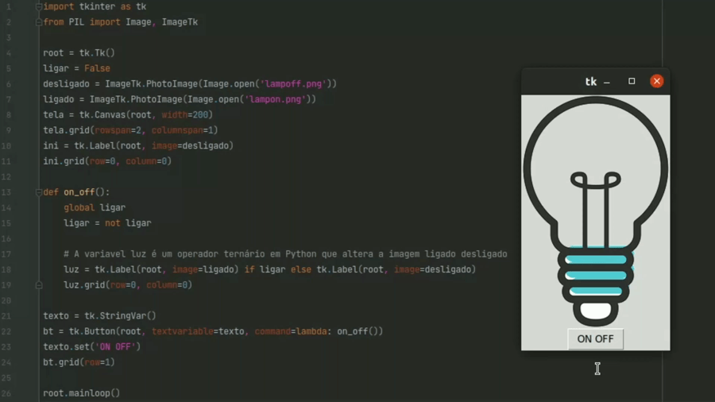

# Lâmpada (Python - tkinter)

Lâmpada feita com GUI tkinter

Utilizando conceito de Operador Ternário para Python, utilizando uma variável controladora que altera entre a lâmpada ligada e desligada.

Sintaxe: <i>variavel = 'valor_True' <b>if</b> bool <b>else</b> 'valor_False'</i>

\* refatorado utilizando a lampada numa classe, retirando assim a global var como me foi recomendado por boas práticas 
\* imagem ainda da versão antiga

&reg; <i>08/2021</i>
<i>updated on <b>03/2022</b></i>

